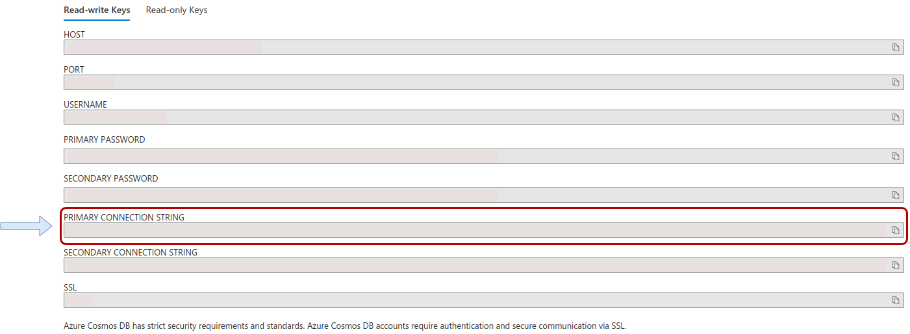
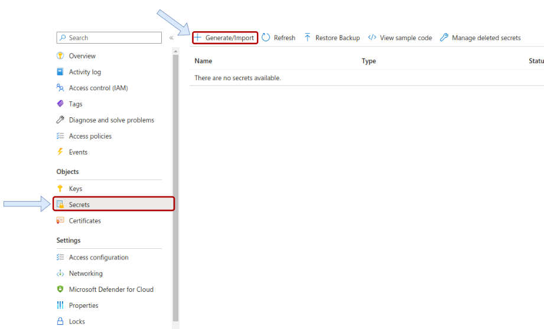
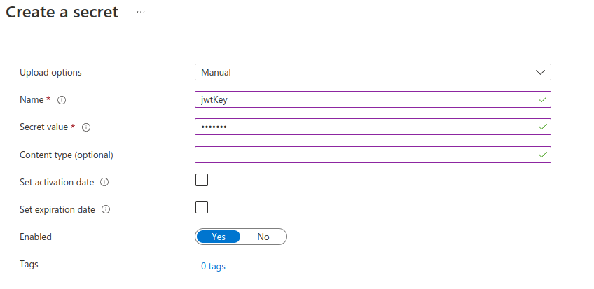
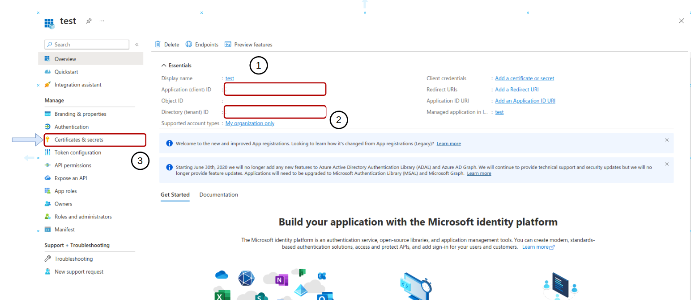
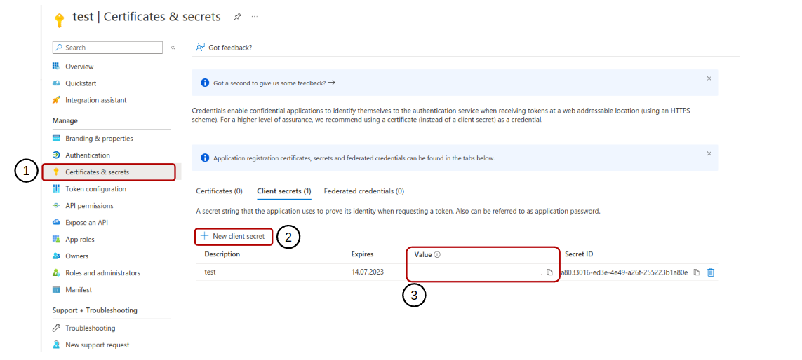
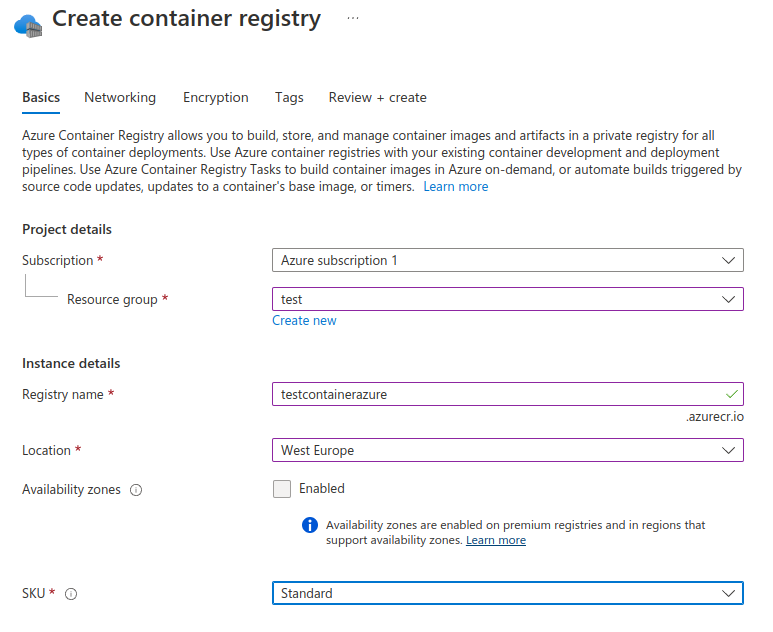
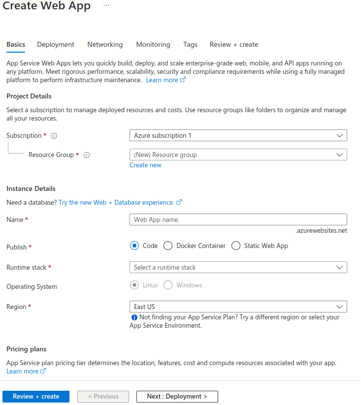

# BACKEND-NodeJS
## Basic Knowledge
What is API?
API (Application Programming Interface) is an interface that allows a software system or application to access data or use its functions with other software systems or applications. It enables communication and integration between software systems through APIs, programming languages, protocols and standards.

What is Docker?
Docker is a software platform. This platform allows applications to run on different operating systems and on different computers, protected from the effects of the environment in which they are run. This is done by creating an executable unit called a "container" that contains all the required dependencies of the application. These containers contain all the resources needed to run the application and provide all the necessary environment for the application to run. With Docker, applications can be run the same way on different operating systems or different computers, making it easier to create and manage the environments necessary for the application to run.

## Learn more

For more information about the function mentioned in this section, you can follow this link.  <https://learn.microsoft.com/en-us/azure/azure-functions/functions-overview>

For more information about the Cosmos DB mentioned in this section, you can follow this link. <https://learn.microsoft.com/en-us/azure/cosmos-db/>

For more information about the KeyVault mentioned in this section, you can follow this link. <https://learn.microsoft.com/en-us/azure/key-vault/>

## Development

#### 1. Create Azure Cosmos MongoDB and KeyVault service.

#### 2. Go to the Cosmos DB service and click on the connection string option in the settings section.


#### 3. Copy "PRIMARY CONNECTION STRING"

### 4. Go to the KeyVault service and click on the Secrets option in the Object section.





#### 5. Final Step.
    and then create 4 env variable

    
    TENANT_ID = {your_tenant_id}
    CLIENT_ID = {your_client_id}
    CLIENT_SECRET = {your_client_secret}
    KEY_VAULT_URL = {your_key_vault_url}

    Write this information into the dockerfile.
 


> Register an application: 
    * name : test

> TENANT_ID and CLIENT_ID

  
    
> Create Certificates & Secrets



## USAGE
```docker
# requirement
    docker build -t backend .
# start
    docker run --name api -p 5000:80 run backend
```
## DEPLOYMENT
> Create Container Registry Service in Portal



> After making sure that all functions are working, you can deploy to AZURE.

```azure
#in terminal
    az login

#for example: az acr login -n testcontainerazure
    az acr login -n {your_container_registry}

#create docker container
    docker build -t backend .

#give a tag name
#Azure portal side naming must be like this
    docker tag backend testcontainerazure.azurecr.io/backend

#final step deploy
    docker pull testcontainerazure.azurecr.io/backend
```

## AZURE APP SERVICES
> After deploying Docker container azure, you can put it "up" with app service or container instance services. When you select the docker container option in the service settings, you will see the deployed container. Set the necessary configurations and switch the service to the up state.


