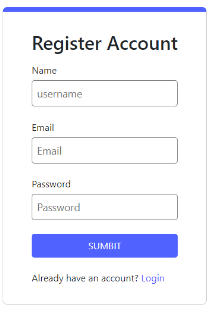
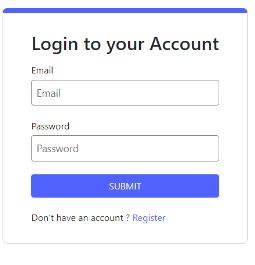
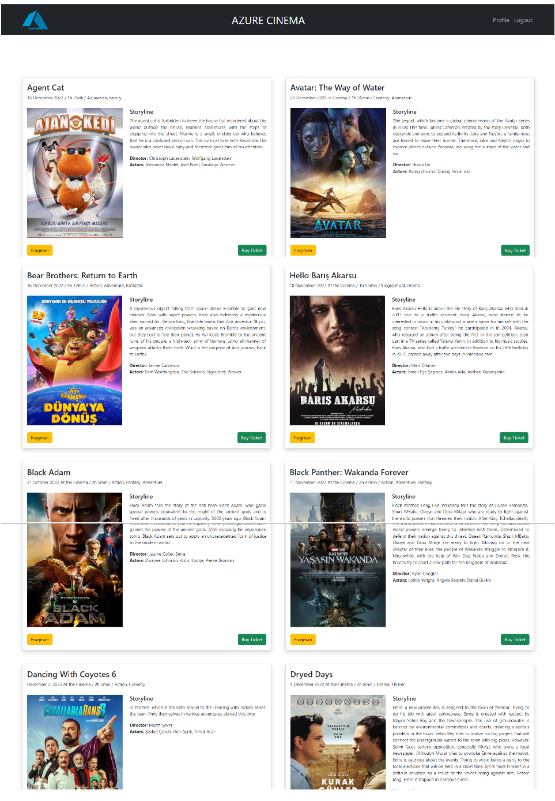
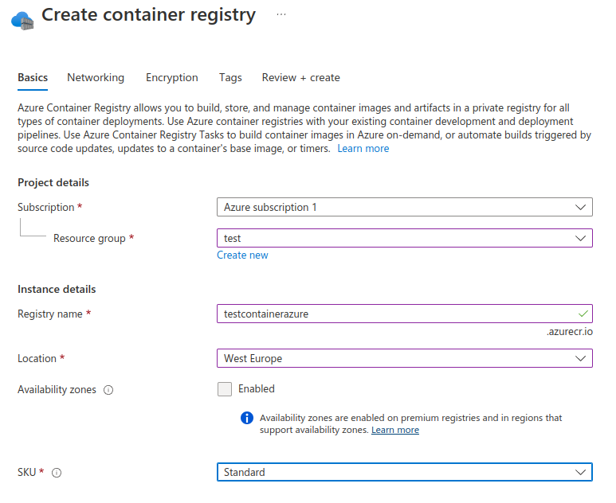
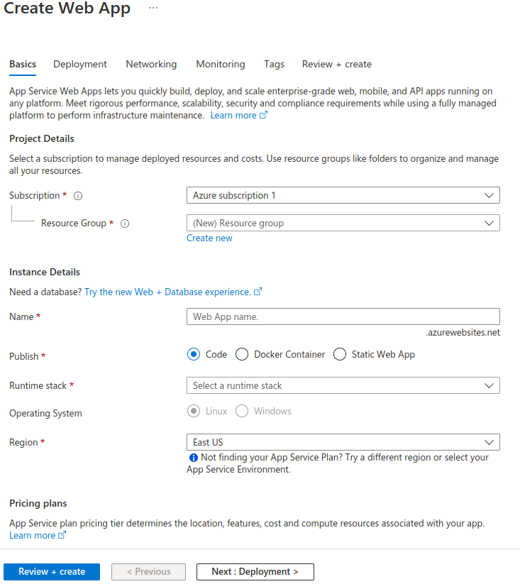

# Client - ReactJS

React is a JavaScript library developed by Facebook in 2013. React is designed to create dynamic and interactive user interfaces for web applications. React has the ability to quickly update the interface when data changes.

## How it works

React manages the appearance of web pages using a structure called virtual DOM. Virtual DOM is a data structure outside the real DOM (Document Object Model) that holds a copy of it in memory. React calculates changes in the virtual DOM when data changes and compares it with the real DOM. After identifying the minimum differences between the virtual DOM and the real DOM, React only implements the changes in the real DOM. This allows web pages to be updated more quickly and efficiently.

```react
# create project
    npx create-react-app {your_app_name}
# start
    npm start
# build
    npm build
```

## Learn more

<TODO> Documentation
For more information about the JavaScript mentioned in this section, you can follow this link. <https://www.w3schools.com/js/default.asp/>

For more information about the React mentioned in this section, you can follow this link. <https://create-react-app.dev/>

## Development

#### 1. First of all, go under the Backend folder and open a terminal.

```backend
npm run start:dev
```

#### 2. Go to the client folder and open a terminal

```client
npm start
```
## PAGES

#### 1. Register Pages
> Users must register to the system before purchasing movie tickets. Unregistered users are not directed to the ticket purchase page.


#### 2. Login Pages
> Users who complete the registration process are directed to the login page.


#### 3. Cinema Pages
> Users who complete the login process can purchase tickets from the movies that are shown.



## USAGE
```docker
# requirement
    docker build -t clientazure .
# start
    docker run --name clientazure -p 3000:80 run clientazure
```
## AZURE CONFIGURATION and DEPLOY
> Create Container Registry Service in Portal



> After making sure that all functions are working, you can deploy to AZURE.

```azure
#in terminal
    az login

#for example: az acr login -n testcontainerazure
    az acr login -n {your_container_registry}

#create docker container
    docker build -t clientazure .

#give a tag name
#Azure portal side naming must be like this
    docker tag backend testcontainerazure.azurecr.io/clientazure

#final step deploy
    docker pull testcontainerazure.azurecr.io/clientazure
```

## AZURE APP SERVICES
> After deploying Docker container azure, you can put it "up" with app service or container instance services. When you select the docker container option in the service settings, you will see the deployed container. Set the necessary configurations and switch the service to the up state.

