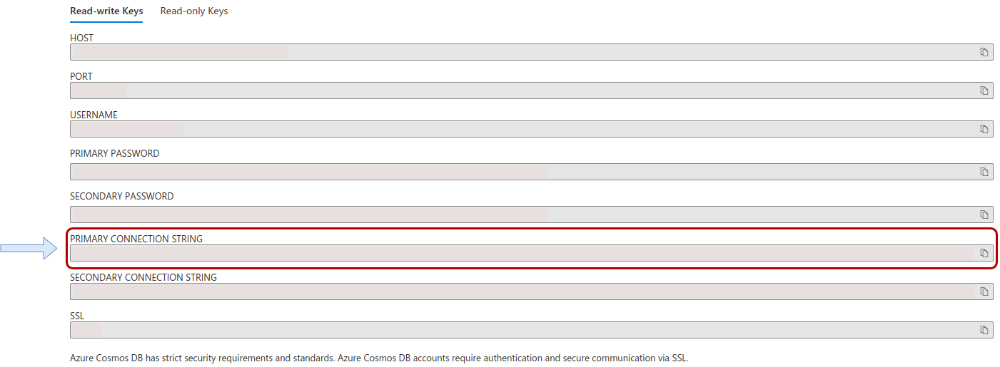
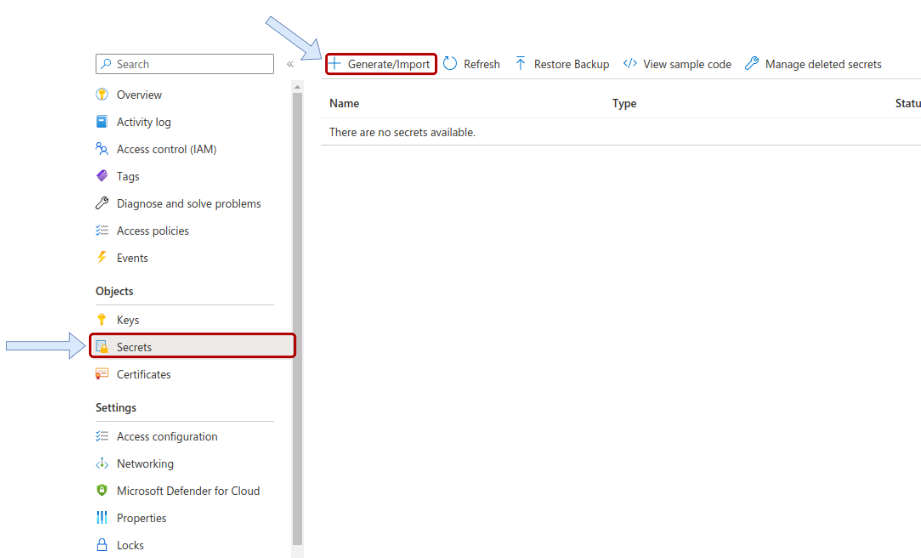
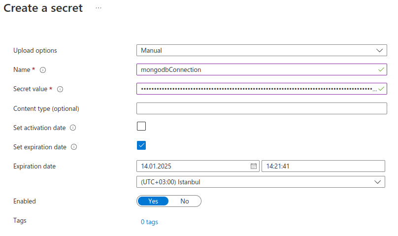
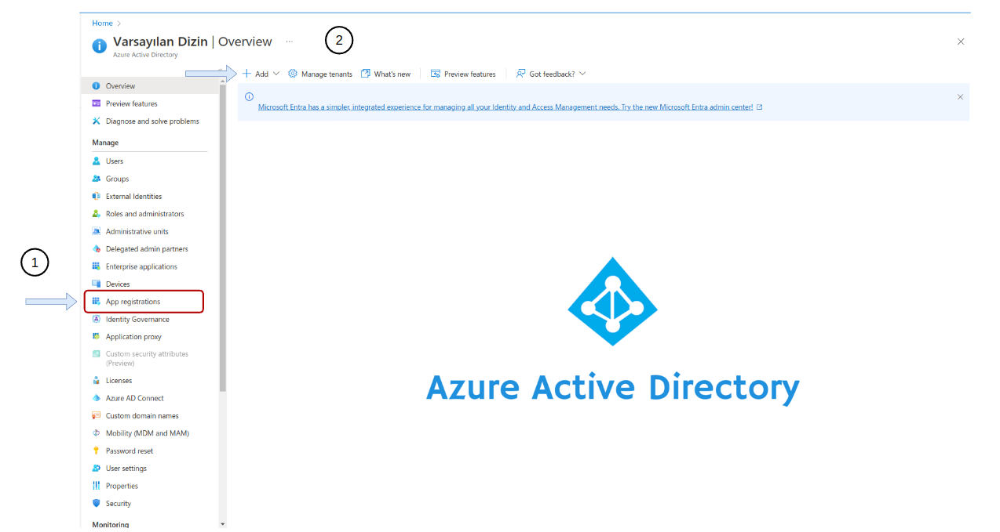
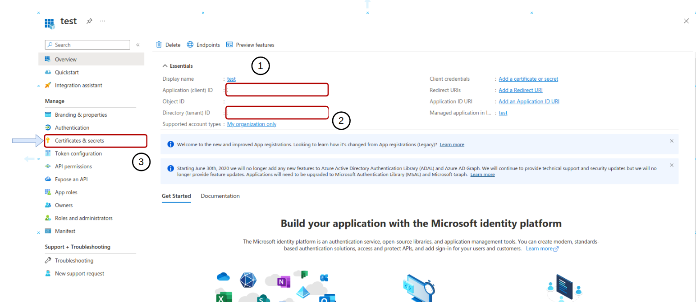
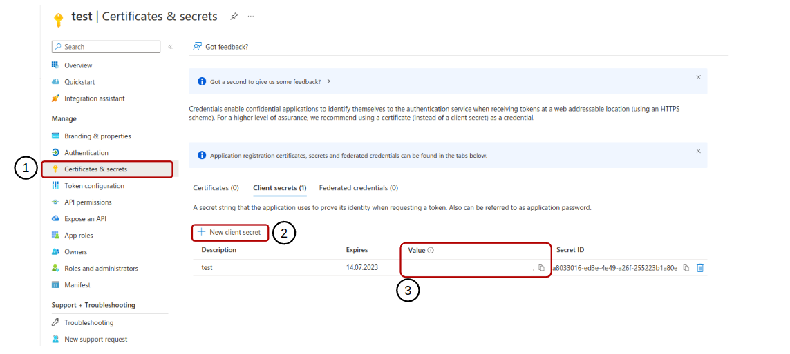

# HTTPTrigger - JavaScript

An Azure `HTTP trigger` is a type of Azure Function that runs in response to an HTTP request. When a request is made to the specified endpoint, the function is triggered and executed. The request and response data is passed to the function as input and output parameters, allowing the function to process the data and return a response. Azure HTTP triggers can be used to build web APIs, handle form submissions, and perform other actions in response to HTTP requests.

## How it works

Azure `HTTP trigger` is a type of Azure function that runs in response to an HTTP request. When a request is made to the specified endpoint, the function is triggered and executed. The request and response data is passed to the function as input and output parameters, allowing the function to process the data and return a response. Azure HTTP triggers can be used to create web APIs, handle form submissions, and perform other actions in response to HTTP requests.

## Learn more

For more information about the function mentioned in this section, you can follow this link.  <https://learn.microsoft.com/en-us/azure/azure-functions/functions-overview>

For more information about the Cosmos DB mentioned in this section, you can follow this link. <https://learn.microsoft.com/en-us/azure/cosmos-db/>

For more information about the KeyVault mentioned in this section, you can follow this link. <https://learn.microsoft.com/en-us/azure/key-vault/>

## Development

#### 1. Create Azure Cosmos MongoDB and KeyVault service.

#### 2. Go to the Cosmos DB service and click on the connection string option in the settings section.


#### 3. Copy "PRIMARY CONNECTION STRING"

### 4. Go to the KeyVault service and click on the Secrets option in the Object section.



#### 5. Final Step.
    mkdir .env

    and then create 4 env variable

    
    TENANT_ID = {your_tenant_id}
    CLIENT_ID = {your_client_id}
    CLIENT_SECRET = {your_client_secret}
    KEY_VAULT_URL = {your_key_vault_url}
 


> Register an application: 
    * name : test

> TENANT_ID and CLIENT_ID
  
    
> Create Certificates & Secrets


## USAGE
```node
# requirement
    npm install -g azure-functions-core-tools@3 --unsafe-perm true
# start
    func start
```
#### DEPLOY
> After making sure that all functions are working, you can deploy to AZURE.
