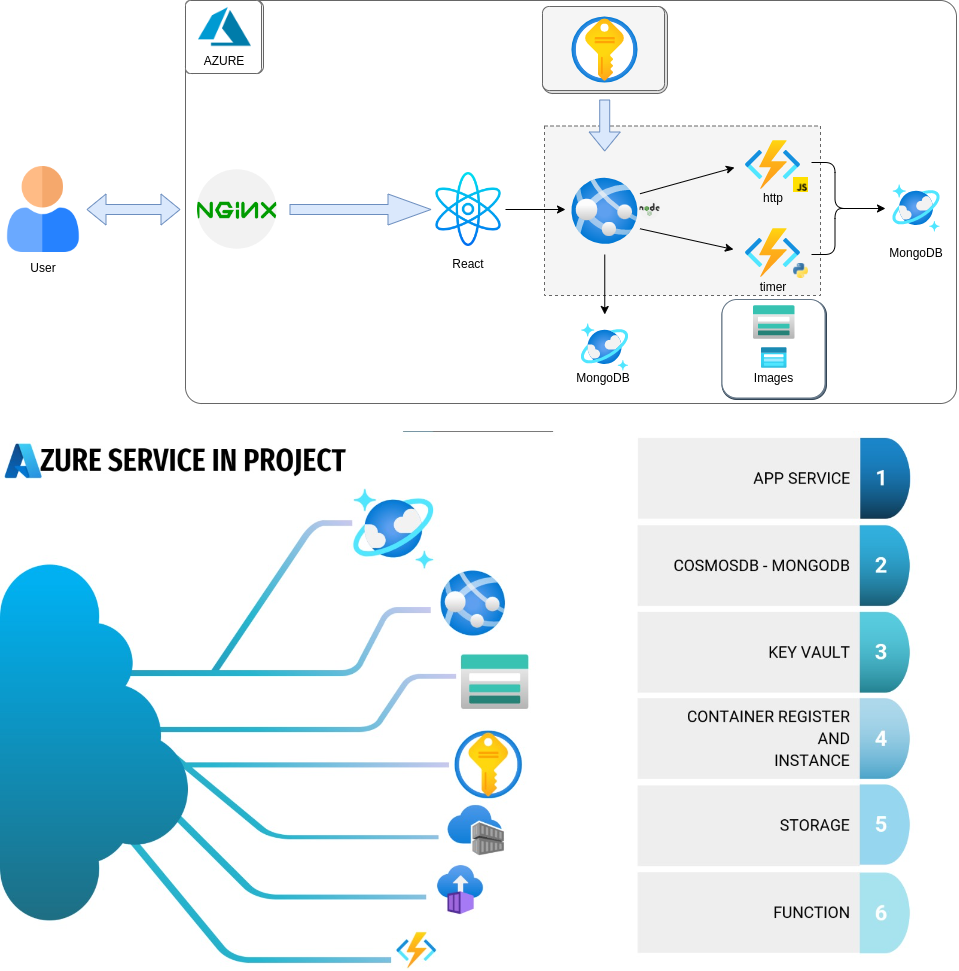

# AZURE PROJECT
Azure services are used in this project. You can run the same project on Azure by following the instructions inside the services.

#### 1. APP SERVICE
- Azure Web Services is a service that provides hosting of web applications offered on Microsoft's cloud computing platform Azure.

#### 2. COSMOSDB - MONGODB
- Azure Cosmos DB is a global, real-time database service offered on Microsoft Azure cloud computing platform.

- MongoDB is one of the NoSQL database systems.

#### 3. KEY VAULT
- Azure Key Vault is a service provided by Microsoft on their cloud computing platform Azure. It allows you to securely store and manage keys, certificates, and passwords used in your applications.
#### 4. CONTAINER REGISTER AND INSTANCE
- Azure Container Registry (ACR) is a service provided by Microsoft on their Azure Cloud Platform. It is a fully-managed container registry service that allows you to store, manage, and distribute Docker images and other types of container images.

- Azure Container Instances (ACI) is a service provided by Microsoft on their Azure Cloud Platform. It is a way to easily run containerized applications on Azure, without the need to manage any underlying infrastructure or orchestration.

#### 6. STORAGE ACCOUNT
- Azure Storage Accounts is a service provided by Microsoft on their cloud computing platform Azure. It allows you to securely store and access your data.
#### 7. FUNCTION

- Azure Functions is a service provided by Microsoft on their Azure Cloud Platform that allows you to run small pieces of code, called "functions," in the cloud without having to provision or manage any underlying infrastructure.

 

