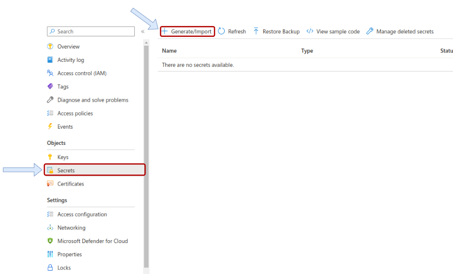
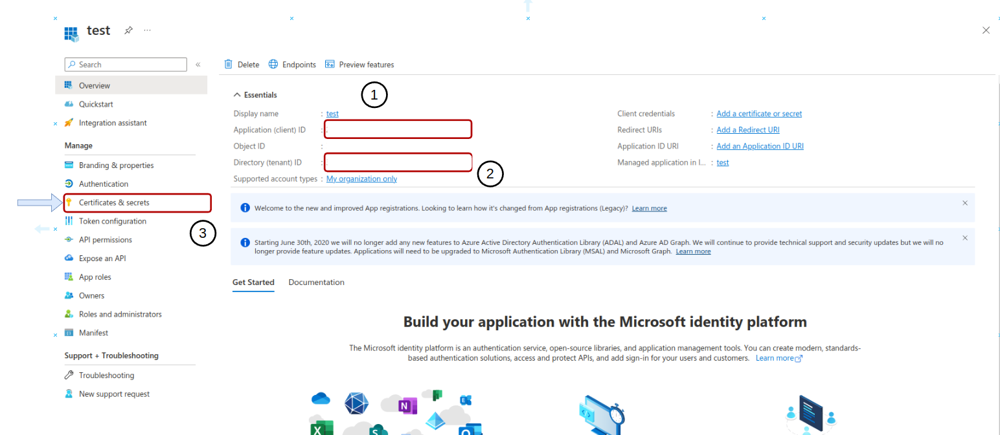
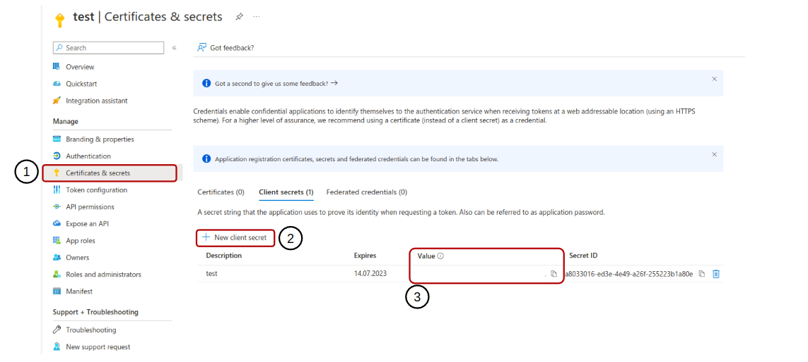

# TimerTrigger - Python

The `TimerTrigger` makes it incredibly easy to have your functions executed on a schedule. This sample demonstrates a simple use case of calling your function every 5 minutes.

## How it works

For a `TimerTrigger` to work, you provide a schedule in the form of a [cron expression](https://en.wikipedia.org/wiki/Cron#CRON_expression)(See the link for full details). A cron expression is a string with 6 separate expressions which represent a given schedule via patterns. The pattern we use to represent every 5 minutes is `0 */5 * * * *`. This, in plain text, means: "When seconds is equal to 0, minutes is divisible by 5, for any hour, day of the month, month, day of the week, or year".
## Learn more

<TODO> Documentation
For more information about the function mentioned in this section, you can follow this link.  <https://learn.microsoft.com/en-us/azure/azure-functions/functions-overview>

For more information about the Cosmos DB mentioned in this section, you can follow this link. <https://learn.microsoft.com/en-us/azure/cosmos-db/>

For more information about the KeyVault mentioned in this section, you can follow this link. <https://learn.microsoft.com/en-us/azure/key-vault/>

## Development

#### 1. Create Azure Cosmos MongoDB and KeyVault service.

#### 2. Go to the Cosmos DB service and click on the connection string option in the settings section.


#### 3. Copy "PRIMARY CONNECTION STRING"

### 4. Go to the KeyVault service and click on the Secrets option in the Object section.



#### 5. Final Step.
    mkdir .env

    and then create 4 env variable

    
    TENANT_ID = {your_tenant_id}
    CLIENT_ID = {your_client_id}
    CLIENT_SECRET = {your_client_secret}
    KEY_VAULT_URL = {your_key_vault_url}
 


> Register an application: 
    * name : test

> TENANT_ID and CLIENT_ID
  
    
> Create Certificates & Secrets


## USAGE
```node
# requirement
    npm install -g azure-functions-core-tools@3 --unsafe-perm true
# start
    func start
```

#### DEPLOY
> After making sure that all functions are working, you can deploy to AZURE.
